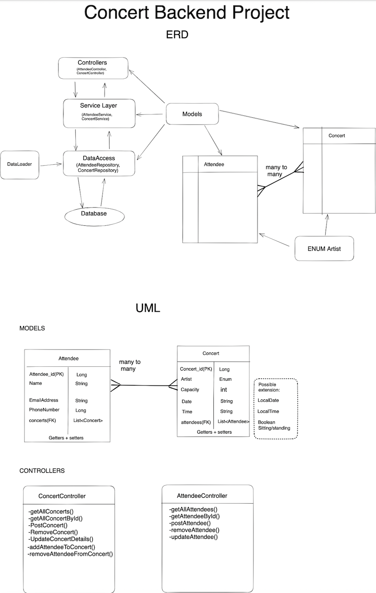

<div style="width:100px ; height:100px">


</div>

<h1 align="center">Hi 👋 we are Track2!</h1>
<h3 align="center">A group of software-engineers-in-training. This is our first BackEnd project.</h3>


### 🚀 Project Outline

<p> In this project we have built an API for a concert booking system. It implements Java, SpringBoot and a Postgres SQL Database.

</p>


###  🌱 MVP

<p>
For started our project by defining our MVP. We decided the most integral logic of the application would be:

- creating, removing and updating concert details
- adding and removing attendees from concerts
- the ability to display all concerts and all attendees

</p>

### 💻 Class Diagram and Entity Relationship Diagram
<div>


</div>

## Tech Stack :
- Intellij, JDK 17
- Spring Boot
- PostgresSQL
- Postman
- Postico

## 💬 How to use the API

## 📫 How to install and run the project

Clone the project

```bash
  git clone https://github.com/caitlinmillar/Backend_Concert
```

Go to the project directory

```bash
  cd Backend_Concert
```

Install dependencies

```bash
  npm install
```

Start the server

```bash
  npm run start
```
## Roadmap

- (What improvements we want to make)


## ⚡ Credits
**Caitlin Millar**: [github](https://github.com/caitlinmillar)

**Berna Yasar** 

**Loshanth Selvanayagam**


**Abdullah Taibi**

[//]: # (<h3 align="left">Connect with me:</h3>)

[//]: # (<p align="left">)

[//]: # (</p>)

<h3 align="left">Languages and Tools:</h3>
<p align="left"> <a href="https://git-scm.com/" target="_blank" rel="noreferrer">  </a> <a href="https://www.java.com" target="_blank" rel="noreferrer">  </a> <a href="https://www.postgresql.org" target="_blank" rel="noreferrer">  </a> <a href="https://postman.com" target="_blank" rel="noreferrer">  </a> <a href="https://spring.io/" target="_blank" rel="noreferrer">  </a> </p>
